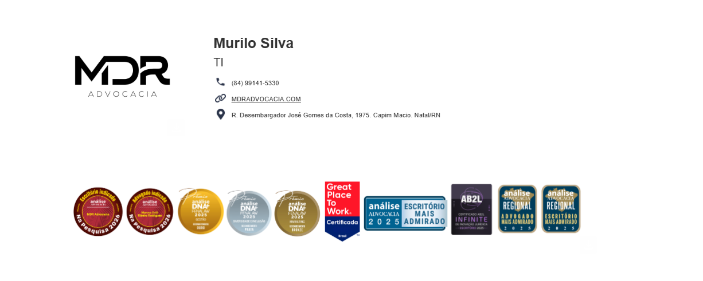

# Gerador de Assinaturas MDR Advocacia

## 📋 Descrição
Sistema web para gerar assinaturas de email profissionais para a MDR Advocacia. Permite customizar nome, cargo, telefone e número OAB (para advogados), com seleção de cores.

---

## 🎯 Funcionalidades

- ✅ **Gerador de Assinatura**: Cria HTML pronto para usar em clientes de email
- ✅ **Seleção de Cargos**: Assistente Jurídico, Advogado, Estagiário, RH, TI
- ✅ **Campo OAB**: Aparece automaticamente ao selecionar "Advogado"
- ✅ **Temas de Cores**: 
  - Azul (Padrão) - #2b344a
  - Branco - #ffffff
  - Preto - #000000
- ✅ **Responsivo**: Logo, ícones e selos formatados automaticamente
- ✅ **Links de Contato**: Site, telefone e endereço com ícones

---

## 📦 Arquivos do Projeto

### Estrutura
```
assinaturas_MDR_TI/
├── Assinaturas.html          # Página principal com formulário e lógica
├── EstiloAssinaturas.css     # Estilos do formulário
├── README.md                  # Este arquivo
├── assets/
│   └── assinaturas.png        # (DESNECESSÁRIO - não utilizado)
└── Logo MDR Advocacia branca.png  # Logo local (usado na página)
```

### Arquivos em Uso
- **Assinaturas.html** - Arquivo principal com:
  - Formulário de entrada (linhas 19-44)
  - Funções JavaScript para geração (linhas 53-145)
  - Gerador e validação de dados (linhas 133-145)
  
- **EstiloAssinaturas.css** - Estilos do formulário:
  - Gradiente de fundo azul
  - Grid responsivo
  - Cores corporativas (#004e92)

---

## 🖼️ Fontes de Imagens

### 1️⃣ Logo da Página (Local)
- **Arquivo**: `Logo MDR Advocacia branca.png` (no diretório raiz)
- **Uso**: Exibido no topo do formulário (linha 10)

### 2️⃣ Logos da Assinatura (Google Drive)
| Versão | ID Google Drive | Cor | Uso |
|--------|-----------------|-----|-----|
| Branca | `1nwRhYl1Jo3c55twJ_Zs29syqSIu3vpV0` | Branca | Tema Azul/Preto |
| Azul | `1ZhgK53kfd9kFy0SUJCCHn864MpcRlPiY` | Azul | Tema Branco |

### 3️⃣ Ícones (Google Drive)
| Ícone | Tema Azul | Tema Branco |
|-------|----------|------------|
| Telefone | `1GqmGSnFlGBgkQLDpUxfaK8-LHs5r2sev` | `1gBdq236eJvx30PUNzg2FPYr7G3wGkOMM` |
| Site | `1ws9y6duhKAPI8GZeelGlHJd9J2uDboRJ` | `1L3FN8Fo52S9-y7oJTmHLf1EQUpq6QavE` |
| Endereço | `1ctuGgBAIezALXqymOjVs4xn9nQSinmTP` | `1TkNVMf7S-nuv0Ps5Z2Kagfm4Wg1EX1Uf` |

### 4️⃣ Selos e Certificados (Google Drive)
- **ID**: `15UOqmG-rcPEuGZyIKVWzHEvzNtW6MNUw`
- **URL Atual**: `drive.google.com/file/d/{ID}/view?usp=drive_link` 


---

## 🛠️ Como Funciona

### 1. Fluxo de Uso
```
Usuário preenche formulário 
    ↓
Clica em "Gerar Assinatura"
    ↓
JavaScript coleta dados
    ↓
Valida Nome e Telefone
    ↓
Gera HTML com tabelas aninhadas
    ↓
Abre em nova aba
    ↓
Usuário copia para email
```

### 2. Funções JavaScript

#### `toggleOAB()` (linhas 53-64)
- Mostra/esconde campo OAB
- Executada ao mudar de cargo
- Limpa valor ao ocultar

#### `getSignatureTemplate(data)` (linhas 67-120)
- Monta configuração de cores
- Gera HTML com tabelas (compatível com email)
- Substitui variáveis de dados
- Retorna string HTML pronta para email

#### `generateCard()` (linhas 123-145)
- Coleta dados do formulário
- Valida campos obrigatórios
- Chama `getSignatureTemplate()`
- Abre nova aba com resultado

### 3. Estrutura da Assinatura


---

## 🔧 Configurações Personalizáveis

### Cores (no `getSignatureTemplate`)
```javascript
// Tema Azul (padrão)
bgColor: '#2b344a'
textColor: '#ffffff'

// Tema Branco
bgColor: '#ffffff'
textColor: '#333333'

// Tema Preto
bgColor: '#000000'
textColor: '#ffffff'
```


## 📝 Como Usar

### 1. Abrir a Página
- Abra `Assinaturas.html` em um navegador

### 2. Preencher Formulário
- Digite o nome completo
- Selecione o cargo
- Insira o telefone
- Se for advogado, preench o OAB
- Escolha a cor da assinatura

### 3. Gerar Assinatura
- Clique em "Gerar Assinatura"
- Uma nova aba se abrirá com o resultado
- Selecione todo o conteúdo (Ctrl+A)
- Copie (Ctrl+C)

### 4. Usar em Email
- Abra seu cliente de email
- Cole em uma assinatura ou novo email
- Ajuste se necessário

-

## 📄 Licença
Desenvolvido para MDR Advocacia - Uso interno

---

## 📞 Suporte
Para dúvidas ou modificações, entre em contato com o departamento de TI.
